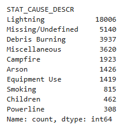
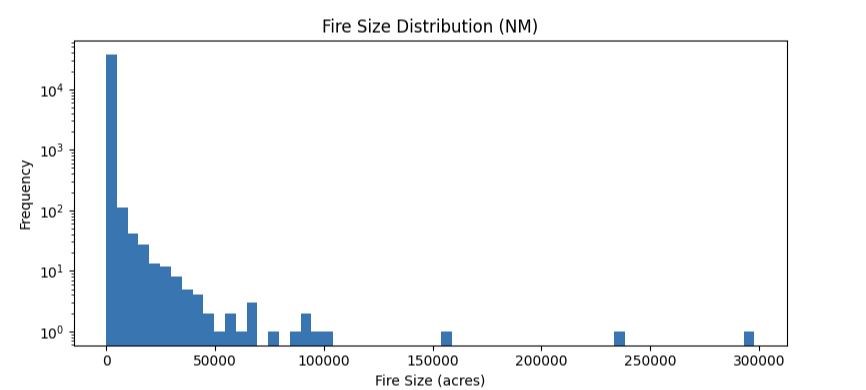
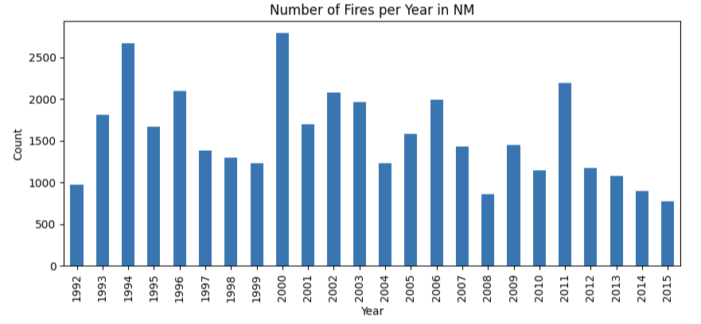
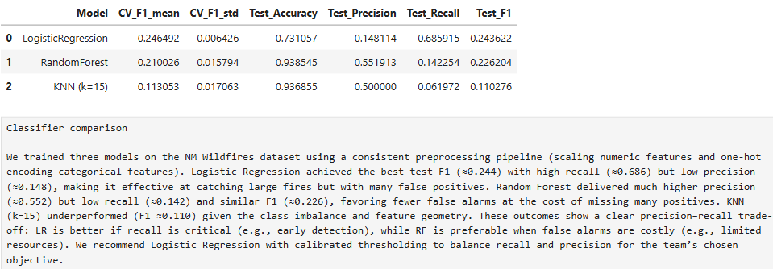
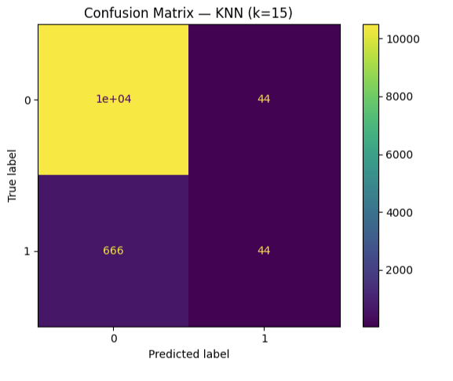
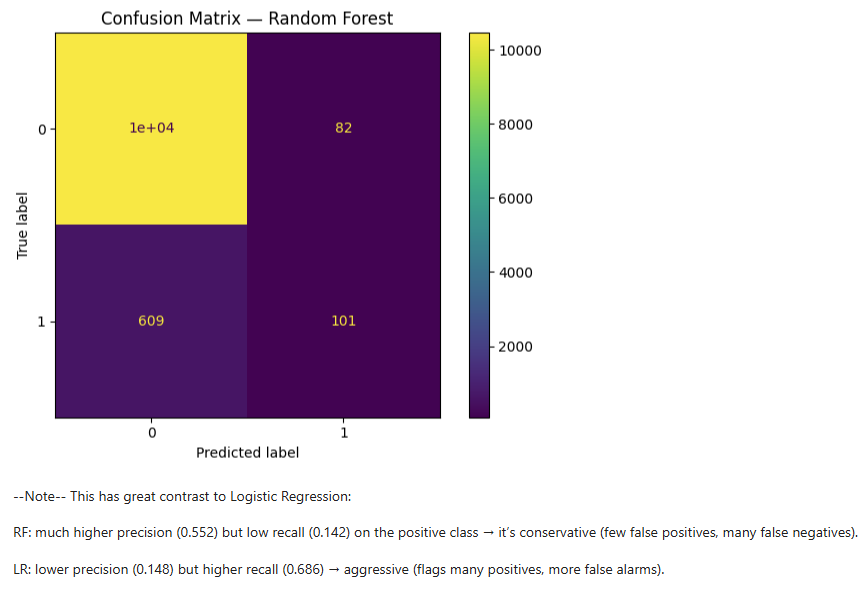
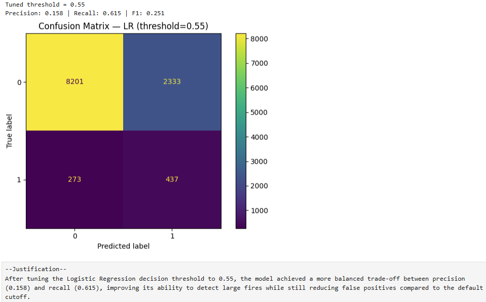

# Wildfire Risk Prediction Using Machine Learning

## Project Overview

This project analyzes wildfire activity patterns in New Mexico using machine learning, historical wildfire records, and environmental datasets derived from the FPA-FOD wildfire database. The objective was to identify wildfire trends, examine fire size distributions, evaluate wildfire causes, and develop classification models capable of detecting larger wildfire events.

The project followed a complete machine learning and analytics workflow including:
- Database extraction and preprocessing
- Data cleaning and transformation
- Exploratory data analysis (EDA)
- Feature engineering
- Model training and evaluation
- Threshold tuning
- Performance comparison across classifiers
- Confusion matrix analysis
- Precision/recall tradeoff evaluation

The analysis focused heavily on handling class imbalance and improving large-fire detection performance using multiple classification approaches.

As team leader, responsibilities included coordinating project phases, organizing notebooks and analytical workflows, integrating model evaluation results, guiding feature selection decisions, and overseeing final project development and reporting.

---

## Business Problem

Wildfires create major environmental, economic, and public safety challenges across the Southwestern United States. Accurate wildfire prediction and early detection are critical for emergency response planning, resource allocation, land management, and environmental risk reduction.

This project explored whether historical wildfire characteristics and environmental indicators could be used to classify and predict higher-risk wildfire events while evaluating the effectiveness and limitations of multiple machine learning techniques.

The project also demonstrates how predictive analytics and data mining techniques can support real-world environmental decision-making processes.

---

## Dataset Information

The project utilized wildfire data derived from the FPA-FOD (Fire Program Analysis Fire-Occurrence Database), including wildfire incidents across New Mexico between 1992–2015.

Key variables analyzed included:
- Fire size
- Fire cause descriptions
- Geographic information
- Temporal wildfire trends
- Large-fire classification indicators

Additional preprocessing and feature engineering steps were performed to prepare the dataset for machine learning analysis.

---

## Tools & Technologies

- Python
- Pandas & NumPy
- SQLite
- Scikit-learn
- Jupyter Notebook
- Matplotlib & Seaborn
- Machine Learning
- Exploratory Data Analysis (EDA)
- Classification Modeling
- Data Mining
- Feature Engineering
- Threshold Tuning
- Confusion Matrix Evaluation

---

## Visualizations & Insights

### Fire Causes in New Mexico

Analyzes the leading causes of wildfire incidents across New Mexico. Lightning represented the most common wildfire cause, followed by miscellaneous and debris-burning related incidents.



---

### Fire Size Distribution

Displays the distribution of wildfire sizes across New Mexico. Most fires remained relatively small, while a small number of extremely large wildfire events created a highly skewed distribution.



---

### Annual Wildfire Trends

Shows wildfire frequency trends across New Mexico between 1992–2015, highlighting fluctuations in wildfire activity over time.



---

### Classifier Performance Comparison

Compares Logistic Regression, Random Forest, and KNN classification models using performance metrics including accuracy, precision, recall, and F1 score.



---

### KNN Confusion Matrix

Evaluates KNN model performance and demonstrates challenges associated with class imbalance and positive wildfire event detection.



---

### Random Forest Confusion Matrix

Illustrates Random Forest classification performance, showing higher precision but lower recall when identifying large wildfire events.



---

### Tuned Logistic Regression

Demonstrates how threshold tuning improved the balance between recall and precision for large wildfire event detection.



---

## Repository Structure

```text
images/        -> Charts, heatmaps, and visualizations
notebook/      -> Jupyter notebooks and ML workflows
report/        -> Final reports and documentation
```

---

## Project Outcome

The project demonstrated the challenges associated with wildfire prediction due to severe class imbalance and environmental variability. Logistic Regression with threshold tuning produced the most balanced wildfire detection performance, while Random Forest achieved higher precision at the cost of lower recall.

The analysis reinforced the importance of evaluating precision, recall, F1 score, and threshold optimization rather than relying solely on overall accuracy when working with high-risk environmental prediction problems.
